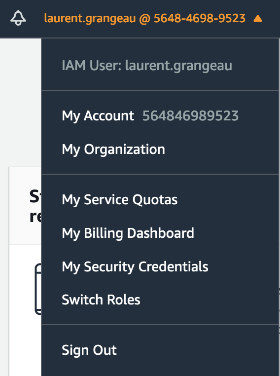
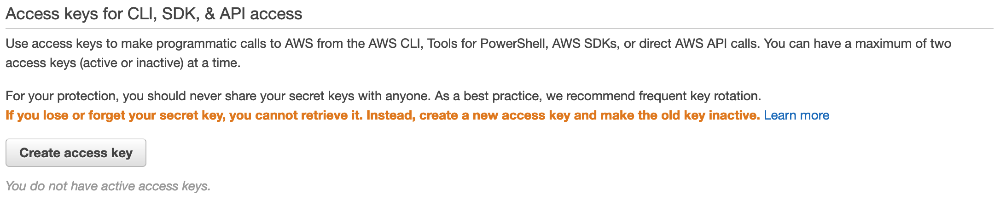
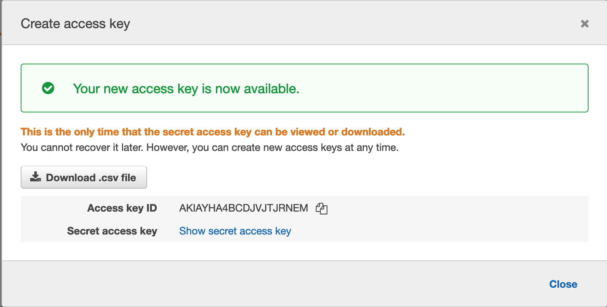

# Cloud public - TP3

## Instructions
Durant ce TP, nous allons mettre en oeuvre Terraform comme vu durant le cours. Le principe de ce TP sera de déployer Petclinic sur les différents infrastructure que propose AWS (IaaS, PaaS, Container) en n'utilisant uniquement que Terraform. Chaque réponse sera à rendre sous forme de **Pull Request** dans le repository. Chaque étudiant devra alors commiter les fichiers Terraform nécessaire à la création des environnements.

Un bref rappel de l'architecture de l'application


Le TP est découpé en deux parties : le fichier `README.md` suivant, ainsi qu'un dossier `answer` qui contiendra la totalité des fichiers Terraform à rendre pour ce TP.

## 1 : Git
### 1.0 : Forker le repo du lab
Suivre le lien présent au tableau pour forker ce repository dans votre repository personnel GitHub Classroom. Si vous avez accès au repository, cela veut dire que la manipulation a bien fonctionné.

### 1.1 : Cloner le repository
Clonez le repo nouvellement copié sur votre ordinateur 
> A partir de maintenant, **vous ne travaillerez plus que dans votre copie**. Vous n'avez plus à revenir sur [le projet parent](https://github.com/cours-hei/tp3).

Pour des questions de simplicité, les fichiers `main.tf` et `provider.tf` sont fournis dans chacun des dossiers.

## 2 : Terraform
### 2.0 : Installation de Terraform
Afin de pouvoir effectuer ce TP, il est nécessaire d'installer **Terraform**. La page d'installation de Terraform est disponible à l'adresse suivante : https://www.terraform.io/downloads.html

### 2.1 : Accès à votre console AWS
Pour avoir accès à votre console AWS, il est nécessaire de générer les `access_key` et `secret_key` de votre compte AWS. Pour se faire, se connecter à son compte AWS et cliquer sur `My Security Credentials` dans le menu de son `Account`



Ensuite, il suffit de générer les `access_key` et `secret_key` en cliquant sur le bouton `Create access key`



Une `access_key` et une `secret_key` masquée seront alors générées



Pour les utiliser, il faut alors faire un export des variables d'environnement `AWS_ACCESS_KEY_ID` et `AWS_SECRET_ACCESS_KEY`

```
$ export AWS_ACCESS_KEY_ID="anaccesskey"
$ export AWS_SECRET_ACCESS_KEY="asecretkey"
$ terraform init
```

## 3 : IaaS
### 3.0 : Installation de PetClinic
Le principe de ce premier TP est de créer le(s) fichier(s) nécessaire(s) pour la création d'une machine virtuelle contenant PetClinic et sa base de données MariaDB.

Pour ce TP, il est nécessaire de créer les objets suivants sur AWS :
- [aws_instance](https://registry.terraform.io/providers/hashicorp/aws/latest/docs/resources/instance)
- [aws_vpc](https://registry.terraform.io/providers/hashicorp/aws/latest/docs/resources/vpc)
- [aws_subnet](https://registry.terraform.io/providers/hashicorp/aws/latest/docs/resources/subnet)
- [aws_internet_gateway](https://registry.terraform.io/providers/hashicorp/aws/latest/docs/resources/internet_gateway)
- [aws_route_table](https://registry.terraform.io/providers/hashicorp/aws/latest/docs/resources/route_table)
- [aws_route_table_association](https://registry.terraform.io/providers/hashicorp/aws/latest/docs/resources/route_table_association)
- [aws_security_group](https://registry.terraform.io/providers/hashicorp/aws/latest/docs/resources/security_group)

Afin de pouvoir interragir avec la machine virtuelle nouvellement créée, il sera nécessaire de passer par un provisionner de type [`remote-exec`](https://www.terraform.io/docs/provisioners/remote-exec.html).

> ⚠️  **WARNING**: Penser à bien commiter les fichiers dans le dossier correspondant avant de passer à la suite

> ⚠️  **WARNING**: Une fois les fichiers créés et commités, penser à bien détruire les ressources AWS créées avec la commande `terraform destroy`

## 4 : PaaS
### 4.0 : Installation de PetClinic
Le principe de ce deuxième TP est de créer le(s) fichier(s) nécessaire(s) pour la création d'un environnement AWS Beanstalk, ainsi que la base de données AWS RDS associée.

Pour ce TP, il est nécessaire de créer les objets suivants sur AWS :
- [aws_elastic_beanstalk_environment](https://registry.terraform.io/providers/hashicorp/aws/latest/docs/resources/elastic_beanstalk_environment)
- [aws_elastic_beanstalk_application](https://registry.terraform.io/providers/hashicorp/aws/latest/docs/resources/elastic_beanstalk_application)
- [aws_elastic_beanstalk_configuration_template](https://registry.terraform.io/providers/hashicorp/aws/latest/docs/resources/elastic_beanstalk_configuration_template)
- [aws_db_instance](https://registry.terraform.io/providers/hashicorp/aws/latest/docs/resources/db_instance)

> ⚠️  **WARNING**: Penser à bien commiter les fichiers dans le dossier correspondant avant de passer à la suite

> ⚠️  **WARNING**: Une fois les fichiers créés et commités, penser à bien détruire les ressources AWS créées avec la commande `terraform destroy`

## 5 : Docker
### 5.0 : Installation de Docker
Afin de pouvoir dérouler ce TP, il est nécessaire d'installer Docker. Pour se faire, aller à l'url suivante : https://www.docker.com/products/docker-desktop et suivre les instructions.

### 5.1 : PetClinic
Nous allons maintenant installer PetClinic dans un container Docker pour l'exécuter. Le but de ce TP est de créer l'image d'exécution de PetClinic. Un fichier `Dockerfile` est déjà fourni avec les paramètres par défaut. Il suffira alors pour ce TP d'ajouter les lignes d'instructions après la partie `# TODO`.

Voici la liste des instructions Docker : https://docs.docker.com/engine/reference/builder/

Une fois les instructions ajoutées, il faut maintenant créer l'image Docker et la pousser dans une registry. Pour ce TP, nous allons utiliser la registry officielle de Docker, le hub Docker.

Si vous n'avez pas de compte sur le hub Docker, il faut en créer un ici : https://hub.docker.com/signup

Une fois votre compte hub créé, vous pouvez maintenant pousser les images créées sur votre compte. Après avoir ajouté les instructions, créer l'image Docker grâce à la commande [`docker build`](https://docs.docker.com/engine/reference/commandline/build/).

Penser à bien tagguer votre image afin de pouvoir la pousser sur le hub Docker (https://docs.docker.com/engine/reference/commandline/build/#tag-an-image--t).

Afin de vérifier que l'image buildée fonctionne, vous pouvez démarrer l'image nouvellement créée avec la commande [`docker run`](https://docs.docker.com/engine/reference/run/). Normalement, les options mis par défaut dans le Dockerfile suffisent à démarrer l'application.

Si l'application ne démarre pas, ou une erreur survient, il est nécessaire de changer le `Dockerfile` et recréer l'image.

Une fois votre image créée et tagguée, vous pouvez maintenant la pousser sur le hub, après vous être loggué :
- https://docs.docker.com/engine/reference/commandline/login/
- https://docs.docker.com/engine/reference/commandline/push/

> ⚠️  **WARNING**: Créer une issue nommée 5.1 avec l'url de votre repo public du hub Docker contenant votre image